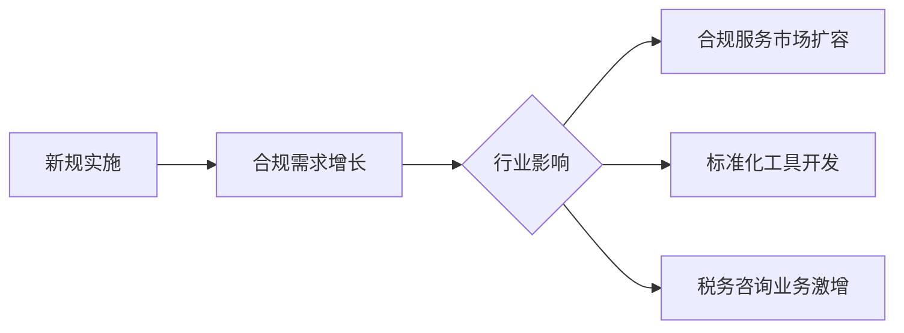

# DeFi企业税务报告新规解读：延期两年，行业迎来缓冲期

## 政策背景与核心内容
美国财政部与国税局（IRS）近期发布针对去中心化金融（DeFi）行业的税务报告新规，明确将DeFi平台向税务机关报送用户数字资产交易数据的合规期限延长至2027年1月1日，较传统加密货币交易所的合规窗口期延长两年。这项调整被视为监管机构对DeFi行业特殊性的重要让步。

### 核心监管框架
1. **Form 1099-DA申报要求**
   - 适用于加密货币经纪商（包括中心化交易所与特定DeFi平台）
   - 涉及交易数据包括买卖记录、资产类型、交易时间、金额及收益计算
   - 申报启动时间：
     - 中心化平台：2025年1月1日起生效
     - DeFi平台：2027年1月1日起生效

2. **差异化监管逻辑**
   - 仅要求前端服务提供商承担报告义务
   - 智能合约开发者、协议层运营方等技术主体暂不纳入监管范围
   - 监管机构认为前端服务商掌握核心交易数据

## 行业影响分析
### 运营模式调整
```markdown
| 受影响主体        | 合规义务            | 实施难点                |
|-------------------|---------------------|-------------------------|
| 前端服务商        | 提供交易记录        | 智能合约交互数据解析    |
| 协议开发者        | 暂无直接义务        | 避免被认定为交易平台    |
| 用户端钱包        | 暂无义务            | 数据聚合技术要求        |
```

### 行业争议焦点
1. **法律地位界定难题**
   - DeFi平台主张自身仅为代码工具提供方
   - 监管机构强调前端服务商具备事实控制权
   - 争议案例：2023年Coinbase与SEC的监管诉讼

2. **技术实现挑战**
   - 智能合约自动执行机制与人工干预的界限
   - 跨链交易数据追溯的可行性
   - 零知识证明等隐私技术的合规适配

👉 [获取DeFi合规技术解决方案](https://bit.ly/okx_welcome)

## 行业应对策略
### 合规准备路线图
1. **短期行动（2025-2026）**
   - 建立交易数据追踪系统
   - 开发税务数据自动化处理模块
   - 重组业务架构隔离合规责任

2. **长期战略（2027后）**
   - 对接IRS数据交换接口
   - 推出用户端税务计算工具
   - 构建链上身份验证体系

### 协会维权进展
由区块链协会（Blockchain Association）等三家机构发起的行政诉讼已进入司法程序，指控新规违反《行政程序法》。诉讼核心论点包括：
- DeFi协议不具备传统经纪商的客户关系
- 智能合约执行无需人工干预
- 监管成本远超政策收益

## 未来趋势展望
### 政策不确定性
随着2024年美国大选临近，政策风向可能出现变化。当前规则制定历经三年行业协商，但新政府可能：
- 调整合规时间表
- 重新界定DeFi平台责任
- 推动立法明确监管框架

### 行业发展机遇


👉 [探索区块链合规技术前沿](https://bit.ly/okx_welcome)

## 常见问题解答（FAQ）
**Q：DeFi平台与中心化交易所的合规差异？**  
A：中心化平台需在2025年前完成系统部署，而DeFi平台享有额外两年缓冲期，且仅前端服务商需履行报告义务。

**Q：智能合约开发者是否需要承担合规责任？**  
A：根据当前规定，底层协议开发团队暂不承担直接申报义务，但需注意业务模式可能被重新认定。

**Q：用户如何应对新的税务申报要求？**  
A：建议使用支持Form 1099-DA数据导出的钱包工具，同时关注平台方提供的税务计算服务。

**Q：新规对DeFi交易量会产生什么影响？**  
A：短期可能推高合规成本，但长期来看标准化监管有助于吸引更多机构投资者入场。

**Q：如何判断自身业务是否属于申报范围？**  
A：需重点评估是否具备用户身份识别、交易撮合、费用收取等经纪商特征，建议咨询专业税务顾问。

👉 [获取DeFi税务合规评估工具](https://bit.ly/okx_welcome)

## 专家观点
安永税务专家Jonathan Jackel指出："新规实质上重构了DeFi行业的监管边界，前端服务商需在技术架构中嵌入合规模块，这将催生新的技术解决方案市场。"

行业观察人士Thomas Shea补充："尽管存在诉讼风险，但监管框架的初步确立为行业发展提供了确定性，这可能加速传统金融机构参与DeFi市场。"

## 实施时间轴
```
2024 Q4 - 新规正式生效
2025 Q1 - 中心化平台启动数据申报
2026 Q2 - DeFi平台技术适配期
2027 Q1 - DeFi平台正式履行申报义务
2028 - 监管规则首轮评估
```

这项历时三年协商的监管改革，标志着美国在加密资产征管领域迈出关键一步。行业参与者需把握窗口期完成技术改造，同时密切关注司法诉讼与政策变化，为即将到来的合规时代做好准备。