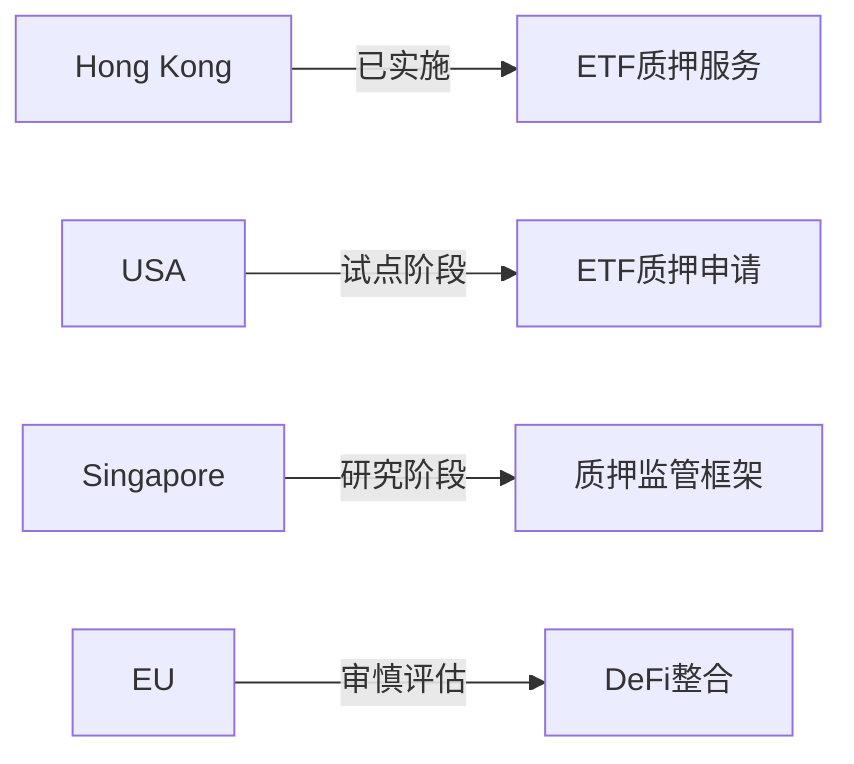

# OKG Research：香港率先开放加密资产质押将带来哪些影响？

## 加密资产质押纳入传统金融体系

香港证监会近日发布的重要政策，正式允许虚拟资产现货ETF在审慎监管框架下参与链上质押活动。这项突破性举措不仅标志着全球首个将传统金融产品与链上经济机制相结合的实践案例，更为投资者打开了合规获取链上收益的新通道。

据OKG Research数据显示，以太坊网络质押量已达3400万枚ETH，占总供应量28.03%；Cardano和Solana质押率更长期维持在70%以上。这充分证明质押机制已获得广泛市场共识，成为支撑公链网络安全与收益获取的核心基础设施。

### 监管框架下的质押创新

新政明确要求：
1. 质押操作须通过持牌交易平台执行
2. 设定质押比例上限控制流动性风险
3. 强制披露收益模型与风险控制机制
4. 开放除ETH外的多链质押服务

👉 [掌握合规质押操作全流程](https://bit.ly/okx_welcome)

**风险控制体系亮点**：
| 控制维度 | 具体措施 | 实施效果 |
|---------|---------|---------|
| 资产托管 | 第三方授权机构监管 | 保障资产独立性 |
| 收益分配 | 透明化计算模型 | 维护投资者权益 |
| 流动性管理 | 质押比例上限机制 | 防范系统性风险 |

## 传统金融与链上经济的深度联动

### ETF产品价值重构

新政实施后，虚拟资产现货ETF将实现三大升级：
- 收益结构：从单向价格跟踪转向「资产增值+链上收益」双轮驱动
- 投资价值：年化收益预期提升3-6个百分点
- 产品定位：由基础交易工具升级为复合型资产配置载体

机构投资者调研显示，72%的家族办公室表示将增加配置比例，主要关注：
- 质押收益的稳定性（63%）
- 资产托管安全（58%）
- 收益分配透明度（47%）

### 全球监管格局中的先行优势

在主要司法辖区中，香港已形成独特的监管优势：

👉 [了解全球监管动态对比](https://bit.ly/okx_welcome)

## 市场生态重构路径

### 基础设施升级需求

合规质押需求激增将推动三大技术升级：
1. **托管系统**：开发支持多链质押的智能合约审计体系
2. **风控模型**：建立动态质押比例调整算法
3. **收益分配**：实现链上收益的实时清算与分配

### 产品创新机遇

市场参与者可探索：
- 分级质押产品：不同风险偏好的收益结构化设计
- 跨链质押组合：分散单一网络风险
- 收益衍生品：开发质押收益权的金融衍生工具

## FAQ常见问题解答

**Q1：普通投资者如何参与合规质押？**
A：通过持牌交易平台或持有虚拟资产现货ETF份额即可，无需直接管理私钥。

**Q2：质押收益的来源是否可靠？**
A：收益直接来自区块链网络的通胀奖励，以太坊等主流公链的质押奖励机制已稳定运行超过2年。

**Q3：监管机构如何保障资金安全？**
A：采用三方托管模式，要求质押资产与平台自有资产完全隔离，并强制实施年度审计。

**Q4：质押会影响ETF的流动性吗？**
A：通过动态比例管理（通常控制在30-50%区间）和流动性对冲机制，确保ETF申赎功能正常运作。

👉 [获取质押产品风险评估指南](https://bit.ly/okx_welcome)

## 全球竞争格局展望

在政策落地的6-12个月内，预计将迎来三个重要发展阶段：
1. **基础设施期**（0-3月）：交易平台完成合规质押系统改造
2. **产品创新期**（3-6月）：首批混合收益结构产品面世
3. **生态扩展期**（6-12月）：形成质押收益衍生品市场

当前市场数据显示，香港虚拟资产ETF管理规模已突破45亿美元，预计质押机制引入后，年复合增长率将提升至25%以上。这种结构性增长不仅体现在资产管理规模的扩张，更重要的是推动虚拟资产从「可交易」向「可配置」「可增值」的进化。

监管政策的前瞻性和包容性，正在重塑全球Web3金融创新格局。随着技术标准的完善和产品体系的丰富，香港有望率先构建起连接传统金融与去中心化金融的新型基础设施，为全球数字金融发展提供可复制的制度样本。