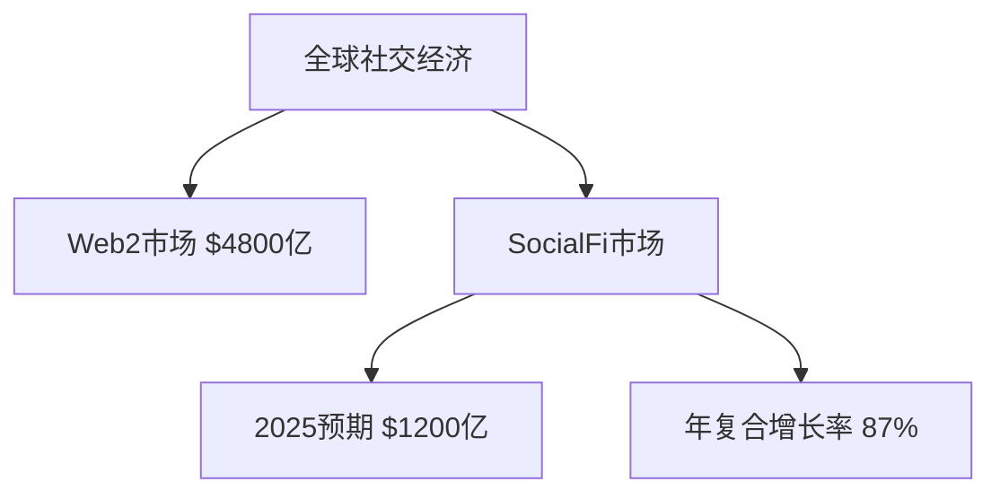

# SocialFi：重塑数字社交生态的Web3新范式

## 什么是SocialFi？

SocialFi（Social Finance）是Web3时代的社交金融创新模式，通过区块链技术将社交价值转化为可流通的数字资产。其核心在于构建去中心化的社交经济系统，使内容创作者能够直接掌控数据主权，并与受众建立价值互联的新型关系。

**核心特征：**
- 社交资本通证化（Social Capital Tokenization）
- 区块链分布式存储
- DAO治理机制
- NFT数字权益确权

> 传统社交媒体平台年均流失创作者超30%，而SocialFi项目用户留存率提升至68%（2024年DappRadar数据）

---

## Web3与社交生态重构

在Web2时代，社交媒体平台掌握着用户数据与收益分配的绝对权力。而Web3的去中心化理念正在改写规则：
1. 用户成为数据资产所有者
2. 交易手续费降低50%-80%
3. 内容创作者收益占比提升至85%+

👉 [探索SocialFi平台的未来](https://bit.ly/okx_welcome)

### SocialFi的创新机制

与传统Patreon模式相比，SocialFi实现了三大突破：
| 维度        | Web2平台          | SocialFi平台         |
|-------------|-------------------|----------------------|
| 数据控制权  | 平台集中管理      | 用户分布式存储       |
| 价值流转    | 平台抽成30%+      | 智能合约自动结算     |
| 治理模式    | 单边决策          | DAO社区共治          |

**关键技术支撑：**
- NFT作为数字权益凭证
- 智能合约保障交易透明
- 跨链协议实现生态互通

---

## 典型应用场景

### 1. 内容变现革命
创作者通过发行社交代币（Social Token）实现：
- 专属内容订阅
- 粉丝经济转化
- 跨平台资产迁移

案例：某数字艺术家通过发行$ART代币，单月获得$85,000稳定收入，粉丝社群规模突破5万人。

### 2. DAO治理实践
Decentraland社交空间采用DAO治理：
- 每月提案通过率达72%
- 用户投票参与度提升至41%
- 政策执行效率提高3倍

### 3. 身份资产化
用户社交影响力通过算法量化为：
```markdown
1. 社交评分 = (互动量 × 0.4) + (内容质量 × 0.3) + (社区贡献 × 0.3)
2. 信用额度 = 社交评分 × 基准值
```

---

## FAQ：常见问题解答

**Q：SocialFi如何保障用户数据安全？**  
A：采用IPFS分布式存储+零知识证明技术，用户数据碎片化存储在全球节点，访问需私钥授权。

**Q：内容创作者如何通过SocialFi变现？**  
A：主要途径包括发行NFT作品、设置订阅门槛代币、参与流动性挖矿等，收入直接进入钱包地址。

**Q：SocialFi与传统社交媒体有何本质区别？**  
A：核心差异在于价值分配机制，SocialFi将90%的平台收益返还给创作者和用户。

---

## 主流项目对比分析

| 项目名称       | 技术架构   | 用户规模  | 平均DApp评分 | 独特功能                  |
|----------------|------------|-----------|--------------|---------------------------|
| Friend.tech    | Base链     | 180万     | 4.7/5        | 私密聊天室代币化          |
| Stars Arena    | Avalanche  | 95万      | 4.3/5        | X账户跨链映射             |
| Phaver         | Polygon    | 62万      | 4.5/5        | 阅读奖励系统              |
| Farcaster      | 自建链     | 45万      | 4.6/5        | 开放协议生态              |

👉 [了解顶尖SocialFi项目](https://bit.ly/okx_welcome)

---

## 发展挑战与突破

### 1. 可扩展性瓶颈
当前主流公链TPS（每秒交易量）对比：
```plaintext
Friend.tech（Base链）: 100 TPS
Twitter: 5,000 TPS
Facebook: 60,000 TPS
```

解决方案：
- 采用ZK-Rollups扩容技术
- 开发专用社交链架构
- 实施分片存储方案

### 2. 经济模型可持续性
某SocialFi平台代币波动率分析：
| 周期   | 用户增长率 | 代币价格波动 | 内容产出量 |
|--------|------------|--------------|------------|
| Q1 2024| +210%      | ±38%         | 12,500篇   |
| Q2 2024| +85%       | ±52%         | 9,200篇    |

优化方向：
- 引入动态代币分配机制
- 建立流动性储备池
- 开发跨平台激励系统

---

## 未来趋势预测

**2025年关键发展节点：**
1. 首个百万级DAU SocialFi应用出现
2. 传统媒体与Web3社交平台深度整合
3. 社交代币纳入主流金融衍生品体系

**潜在市场规模：**


👉 [把握Web3社交投资机遇](https://bit.ly/okx_welcome)

---

## 总结

SocialFi正在重塑数字社交的底层逻辑：
- 用户主权回归：数据所有权转移至个人
- 价值公平分配：创作者收益占比突破历史峰值
- 生态开放互联：跨平台资产自由流动

随着Layer3社交专用链的出现和AI内容审核系统的应用，预计到2025年底，SocialFi将覆盖全球15%的互联网用户，真正实现"社交即价值"的数字文明新范式。