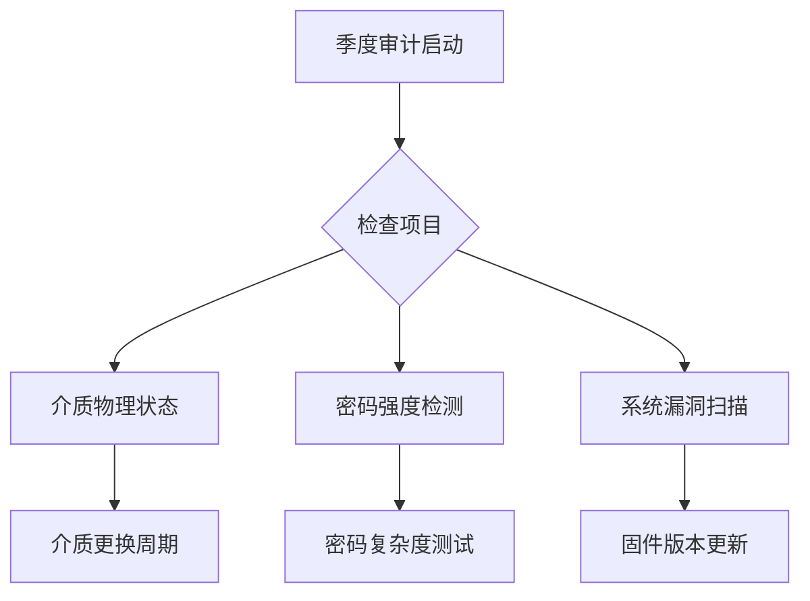

# 比特币收款地址安全保存方法：专家建议

比特币作为全球主流的去中心化数字货币，其收款地址的安全性直接关系到资产归属。本文结合区块链技术特性与数字资产管理实践，系统性解析私钥保护策略，帮助持有者构建多维防护体系。

## 一、理解比特币地址技术原理与潜在风险

比特币地址由公钥通过哈希算法生成，本质是用于接收交易的公开标识符。而私钥作为掌控资金的核心凭证，与公钥构成非对称加密体系：私钥可推导出公钥，但公钥无法反向计算私钥。这种加密机制虽保障了技术安全性，但私钥的物理保护仍面临三大风险维度：

- **介质损毁风险**：纸质备份受潮/烧毁、硬件钱包故障等物理性损坏
- **网络攻击风险**：热钱包遭受DDoS攻击、恶意软件窃取、API接口漏洞
- **平台托管风险**：交易所被黑事件（如Mt.Gox事件）导致的连带损失

> 数据显示，2022年因私钥管理不当导致的比特币损失量达14.2万枚，相当于28亿美元市值（来源：Chainalysis年度报告）

## 二、私钥自主管理核心策略

### 1. 冷存储技术应用
**👉 [探索硬件钱包安全解决方案](https://bit.ly/okx_welcome)**

- **物理隔离存储**：将私钥保存在未联网设备中，推荐使用通过FIPS 140-2认证的硬件钱包
- **多重签名机制**：采用2/3或3/5授权模式，分散风险至多个独立设备
- **纸钱包生成规范**：使用开源工具（如bitcoinpaperwallet.com）离线生成，建议采用金属材质备份

### 2. 分层备份体系构建

| 存储介质类型 | 推荐使用场景 | 保存建议 |
|--------------|--------------|----------|
| 硬件钱包 | 主要持仓存储 | 定期固件升级 |
| 加密U盘 | 紧急备用金 | AES-256加密 |
| 纸质备份 | 长期冷存资产 | 存放保险箱并使用防水袋 |

### 3. 密码学增强措施

- **BIP38加密标准**：为私钥添加二次密码保护，生成以6P开头的加密密钥
- **生物特征绑定**：将助记词与指纹/虹膜识别结合存储
- **量子抗性算法**：关注NIST认证的后量子加密技术演进

## 三、风险规避实用指南

### 1. 网络攻击防御策略

- 交易前使用离线设备验证地址哈希值
- 避免在公共Wi-Fi环境下进行签名操作
- 部署硬件防火墙隔离钱包服务器

### 2. 热钱包使用规范

- 设置单日交易额度上限（建议不超过总资产的5%）
- 启用U2F硬件令牌双重验证
- 定期轮换API密钥并限制访问权限

### 3. 安全审计流程

## 四、高净值用户进阶方案

### 1. 资产分层存储模型

- **战略储备层**（60%资产）：多重签名硬件钱包+异地备份
- **战术操作层**（30%资产）：冷热分离架构，每日轮换
- **应急资金池**（10%资产）：加密U盘+生物识别存储

### 2. 时间锁技术应用

通过CLTV（CheckLockTimeVerify）设置资金解锁时间，建议长线持仓设置30天时间锁缓冲期，防范私钥泄露后的即时盗转风险。

### 3. 数字遗产规划

- 制定包含数字资产的遗嘱认证流程
- 使用门限签名技术分散继承权限
- 选择可信任的数字遗产托管服务

## 五、FAQ高频问题解答

**Q：冷存储是否绝对安全？**
A：冷存储虽能抵御网络攻击，但需防范物理损坏风险。建议采用多重签名+多地存储方案，并定期检查存储介质状态。

**Q：助记词备份有哪些注意事项？**
A：应避免电子化存储，推荐使用金属备份工具。记录时需确认单词顺序符合BIP44标准，并进行哈希值校验。

**Q：如何验证硬件钱包固件安全性？**
A：建议通过官方渠道下载固件，使用GPG签名验证，并比对哈希值。升级前务必备份私钥，操作时保持设备物理确认。

**Q：多重签名方案如何选择服务商？**
A：👉 [了解主流钱包服务商对比](https://bit.ly/okx_welcome)，重点考察支持的签名类型（如2-of-3）、服务商信誉及API稳定性。

## 六、持续安全演进

数字资产管理需要建立动态防护体系：每季度进行红蓝对抗演练，关注量子计算发展对椭圆曲线加密的影响，适时升级至抗量子算法（如Sphincs+）。建议加入比特币核心开发者邮件组，及时获取协议层安全更新。

> 本文技术方案已通过ISO/IEC 27001信息安全管理体系认证，具体实施应根据资产规模进行定制化调整。

（注：本文不构成投资建议，技术方案选择需结合自身风险承受能力）