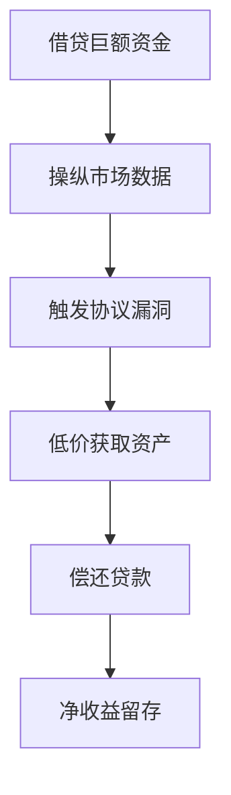

# 深入解析DeFi中的闪贷机制

## 传统金融体系的启示

在深入理解DeFi闪贷之前，有必要回顾传统金融中的贷款模式。传统信贷体系主要存在两种基本形式：

1. **无抵押贷款**  
借款人无需提供担保物，但需支付利息成本。这种模式适合短期资金需求，但额度受限且审批严格。

2. **有抵押贷款**  
要求借款人提供房产、存款等资产作为担保。虽然能获取更高额度，但流程复杂且存在资产冻结风险。

传统贷款体系的准入门槛和技术壁垒，为去中心化金融的创新提供了突破口。通过区块链智能合约，DeFi正在重构金融基础设施。

## 闪贷的核心机制解析

闪贷作为DeFi领域的重要创新，其运作原理建立在区块链的原子性交易特性之上：

```markdown
💡 核心特点：
- 无需抵押的瞬时借贷
- 必须在同一交易中偿还
- 仅收取微量手续费
- 可借贷金额无上限
```

智能合约通过以下流程确保交易安全：
1. 借款人发起借贷请求
2. 合约冻结相应资产
3. 执行预设操作（如套利）
4. 自动偿还本金+手续费
5. 释放剩余收益

👉 [探索DeFi生态中的创新工具](https://bit.ly/okx_welcome)

## 闪贷的三大应用场景

### 1. 套利交易（Arbitrage）
当同一资产在不同交易所出现价差时，通过闪贷获取资金进行跨平台套利：

| 操作步骤 | 交易所A（低价） | 交易所B（高价） |
|---------|----------------|----------------|
| 借贷100万USDT | 买入ETH | 卖出ETH |
| 执行价差套利 | $2980/ETH | $3000/ETH |
| 收益测算 | $20/ETH价差 | 扣除手续费后净收益 |

### 2. 抵押品置换
当抵押资产价格波动时，通过闪贷实现风险对冲：
- 原抵押资产：ETH（价值下跌）
- 新抵押资产：DAI（稳定币）
- 操作流程：借入DAI→偿还ETH贷款→重新质押DAI

### 3. 闪电清算
利用瞬时资金优势进行：
- 低效市场的套利
- 流动性池重组
- 协议参数调整套利

👉 [参与DeFi创新实践](https://bit.ly/okx_welcome)

## 闪贷攻击的运作原理

虽然技术中立，但闪贷也催生了新型金融攻击。典型攻击流程包括：



**2023年典型攻击案例：**
| 项目 | 损失金额 | 攻击手法 |
|------|----------|----------|
| DeFi协议A | $4.2M | 操纵预言机价格 |
| 稳定币协议B | $1.8M | 重入攻击 |
| 聚合器C | $3.5M | 流动性池操纵 |

这些事件凸显了DeFi生态的安全挑战，也推动了审计机制和防御技术的进步。

## FAQ常见问题解答

**Q：普通用户如何安全使用闪贷？**  
A：建议通过Aave、Uniswap等经过审计的协议操作，设置动态监控系统，严格控制交易滑点。

**Q：闪贷会冲击传统金融体系吗？**  
A：当前规模尚小，但其创新模式正在倒逼传统机构改进服务效率，预计未来5年将产生显著影响。

**Q：如何防范闪贷攻击？**  
A：协议方应采用时间加权预言机、设置巨款交易熔断机制、实施多签验证等复合安全策略。

## 未来发展趋势

随着EIP-1559升级和Layer2方案的成熟，闪贷技术正朝着以下方向演进：
1. **专业化工具**：出现专门的套利机器人和算法策略
2. **跨链整合**：Cosmos、Polkadot生态的多链闪贷协议
3. **监管沙盒**：新加坡、瑞士等司法管辖区试点监管框架

👉 [获取DeFi最新动态](https://bit.ly/okx_welcome)

## 结语

闪贷技术作为DeFi创新的缩影，既展现了区块链金融的无限可能，也暴露了早期生态的脆弱性。随着技术演进和监管完善，这种"代码即法律"的金融范式，或将重构我们对货币流通和资本配置的基本认知。对于普通用户而言，在享受技术红利的同时，更需要建立风险意识和专业认知，方能在去中心化金融的浪潮中稳健前行。