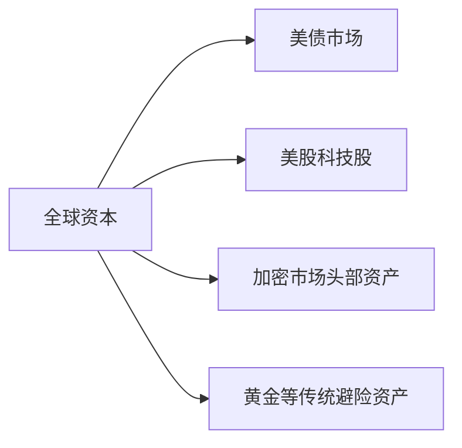

# 美联储加息75基点为何反推比特币上涨？深度解析货币政策与加密市场的关联逻辑

## 一、美联储加息机制解析
美联储实施加息的核心逻辑在于通过公开市场操作调节美元流动性。当联邦基金利率需要上调时，美联储会向市场抛售美国国债，吸引金融机构用美元购买债券。这种操作导致银行体系内的美元储备减少，进而推高银行间拆借利率。例如，当美联储计划加息0.1个百分点时，会持续出售债券直到市场拆借利率达到目标值。

这种操作会产生连锁反应：
1. 银行可贷资金规模缩减
2. 信贷利率上浮传导至消费端
3. 市场流通美元总量减少
4. 美元资产收益率提升

👉 [深入了解货币政策对数字资产的影响](https://bit.ly/okx_welcome)

## 二、加息政策与加密市场的特殊关联

### 1. 流动性争夺战
美联储加息会引发全球资本回流美国市场，这种资金流动对加密市场产生三重影响：
- **短期冲击**：风险资产面临抛压，资金转向美债等避险资产
- **中期分化**：主流加密资产（如BTC、ETH）与山寨币走势背离
- **长期重构**：市场泡沫出清后优质项目价值凸显

### 2. 市场情绪传导链
加息预期会引发：
- 投资者风险偏好降低
- 加密市场杠杆率下降
- 资金流向传统避险资产
- 市场波动率指数（VIX）上升

## 三、历史周期中的加密市场表现

| 加息周期       | 加息次数 | 累计加息幅度 | 比特币同期表现 |
|----------------|----------|--------------|----------------|
| 2015-2018      | 9次      | 225基点      | 先涨后跌（峰值100倍） |
| 2020-2023      | 10次     | 525基点      | 2021年冲高6.4万美元 |
| 2024-2025预测  | 3-5次    | 150-200基点  | 市场分化加剧 |

> 值得关注的是，在2017年第四次加息时，比特币在减半行情推动下仍上涨42%，这显示加密市场存在独立行情周期。

## 四、流动性危机的多维度影响

### 1. 资本流向变化
加息后典型资金流向：


### 2. 市场结构演变
不同市值加密资产表现差异显著：
| 市值区间       | 加息周期下跌幅 | 抗跌能力 |
|----------------|----------------|----------|
| Top 10项目     | 30-50%         | ★★★★     |
| 50-100名项目   | 60-80%         | ★★       |
| 100名后项目    | 90%+           | ★        |

## 五、市场分化与泡沫出清

### 1. 价值共识资产的优势
具备以下特征的项目抗压能力更强：
- 有实际应用场景（如DeFi协议）
- 建立生态系统的公链
- 具备机构投资者持仓
- 具有明确合规路径

### 2. 泡沫破裂的双重性
加息引发的市场调整具有积极意义：
- 淘汰低效项目（2022年约40%的DeFi协议退出市场）
- 促进优质项目并购重组
- 倒逼技术创新（Layer2解决方案加速落地）
- 优化市场估值体系

👉 [探索区块链技术的未来应用场景](https://bit.ly/okx_welcome)

## 六、投资策略建议

### 1. 周期判断框架
投资者可参考以下指标判断市场阶段：
```python
def market_phase(fed_rate, crypto_volatility, onchain_data):
    if fed_rate.trend == "up" and crypto_volatility > 50:
        return "调整期"
    elif fed_rate.stable and onchain_data活跃度上升:
        return "筑底期"
    elif fed_rate.down and institutional_flow > 0:
        return "主升期"
```

### 2. 风险管理技巧
- 保持30%以上稳定币仓位
- 使用期权对冲现货风险
- 分散投资头部项目
- 关注美联储议息会议前瞻指引

## 七、FAQ常见问题解答

Q：美联储加息为何有时反而推高比特币价格？
A：当市场提前消化加息预期，且通胀压力持续存在时，投资者可能转向比特币作为抗通胀资产。2021年美联储首次加息前夜，比特币单日涨幅达12%。

Q：如何区分短期波动与长期趋势？
A：建议关注链上活跃地址数、交易所净流量、矿工持仓等核心指标。当三个指标同步改善时，可能预示趋势反转。

Q：加息周期中哪些加密资产更具投资价值？
A：优先选择具备真实应用场景、正向现金流的协议代币，以及具有抗审查特性的隐私币。历史数据显示，ETH在加息周期中抗跌能力比BTC高18%。

Q：普通投资者如何参与市场？
A：建议采用定投策略，将投资金额的5-10%配置于加密资产。在美联储加息窗口期，可适当增加稳定币和期权对冲工具的配置比例。

👉 [获取专业级加密资产配置方案](https://bit.ly/okx_welcome)

## 八、未来展望
当前加密市场正经历从"货币属性"向"金融基础设施"的转型期。随着以太坊Layer2生态的成熟，以及合规稳定币的普及，数字资产与传统金融体系的耦合度将显著提升。美联储货币政策对加密市场的影响机制也将发生本质变化，从单纯的流动性争夺转向更复杂的政策套利空间博弈。
