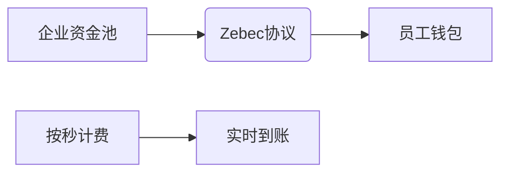

# 解读Zebec：从Solana整合到Nautilus链的革新之路

## Zebec协议的核心价值

在区块链金融领域，Zebec协议（ZBC）正以革新者姿态重塑行业规则。作为Solana生态的创新性DeFi解决方案，该协议通过持续支付系统实现了三大突破：企业资金流自动化、实时薪资结算以及消费者支付体验升级。其独创的连续会计协议（Continuous Accounting Protocol）彻底改变了传统DeFi的流动性管理模式，将稳定币收益实时注入用户钱包。

**核心优势分析：**
- **实时资金流转**：突破传统区块链交易的离散性限制
- **多场景覆盖**：从企业级资金管理到个人支付全面适配
- **Solana生态深度整合**：利用高TPS特性实现毫秒级结算

👉 [深入探索Zebec生态全景](https://bit.ly/okx_welcome)

## Nautilus链的技术革命

2023年8月推出的Nautilus链标志着区块链架构的范式转移。作为全球首个模块化Layer3解决方案，其技术创新体现在：

### 技术架构对比表

| 维度         | 传统Layer1（如ETH） | Nautilus链               |
|--------------|---------------------|--------------------------|
| TPS性能      | 15-45               | 超2000（EVM测试环境）    |
| 隐私保护     | 基础加密            | zkRollup全栈隐私方案      |
| 开发者自由度 | 固定框架            | 模块化组件自由组合        |
| 跨链能力     | 需依赖中继          | Hyperlane原生互操作协议   |

### 模块化创新优势
- **执行层分离**：通过Celestia实现数据可用性层与执行层解耦
- **zkEVM融合**：Eclipse架构实现ZK证明与EVM的完美兼容
- **平行处理**：支持多DApp Rollup并行执行

## ZBC代币经济模型解析

作为Zebec生态的核心治理代币，ZBC通过多重机制构建价值捕获体系：

### 代币功能矩阵

| 功能类别   | 具体应用                      | 经济效应               |
|------------|-------------------------------|------------------------|
| 治理参与   | 协议参数投票、提案质押         | 去中心化决策机制       |
| 支付媒介   | Gas费支付、交易手续费         | 通缩机制（50%手续费销毁）|
| 权益凭证   | 25%交易手续费折扣             | 用户粘性增强           |
| 激励机制   | DApp开发奖励、验证者收益分配   | 生态正向循环           |

👉 [实时追踪ZBC代币价值](https://bit.ly/okx_welcome)

### 通缩模型测算
- **基础销毁率**：协议层50% + Nautilus层25%
- **动态调节**：根据TVL规模自动调整销毁比例
- **质押收益**：预计年化收益8-15%（取决于质押量）

## Web3支付体系重构

Zebec的流支付技术正在颠覆传统金融基础设施：

### 企业级应用场景

**薪资自动化系统**：

**供应链金融优化**：
- 供应商可设置动态支付条件
- 自动触发智能合约结算
- 资金利用率提升40%+

### 消费者支付革新
- **订阅服务**：流媒体平台实现按观看时长计费
- **数字内容**：创作者收益与用户参与度实时挂钩
- **物联网支付**：设备间微支付自动化

## 开发者生态建设

Nautilus链为开发者提供前所未有的自由度：

### 开发者工具矩阵

| 工具类型     | 功能描述                     | 使用优势               |
|--------------|------------------------------|------------------------|
| DApp Rollup  | 模块化应用链部署             | 独立共识+共享安全性    |
| Subnet网络   | 定制化验证者集               | 企业级隐私解决方案     |
| Hyperlane SDK| 跨链通信开发套件             | 无需信任的资产转移     |

### 开发者激励计划
- 2000万美元生态基金支持
- 优先接入zkEVM技术栈
- 免费测试网资源分配

## 常见问题解答

**Q：Zebec与传统DeFi协议的核心区别？**  
A：其连续会计协议突破传统区块链"请求-响应"模式，实现资金流的持续传输，如同HTTP流媒体技术在金融领域的应用。

**Q：Nautilus链如何保证隐私性？**  
A：通过zkRollup全栈加密方案，在保持高吞吐量的同时，实现交易数据的完全匿名化处理。

**Q：ZBC质押的安全性如何保障？**  
A：采用双质押机制（协议层+链层），并通过预言机动态监测质押率，确保系统稳定性。

**Q：如何参与Nautilus生态建设？**  
A：开发者可通过官方SDK工具包部署DApp Rollup，项目方可申请加入生态基金扶持计划。

**Q：未来扩展路线图？**  
A：计划2024年Q2推出Nautilus 2.0，集成AI驱动的智能路由协议，并拓展至Cosmos生态。

## 行业影响展望

在Web3发展进程中，Zebec与Nautilus链正推动三大变革：

1. **支付实时化**：将结算周期从T+1缩短至秒级
2. **金融原子化**：通过DApp Rollup实现模块化金融服务
3. **价值流媒体化**：内容创作与收益的实时映射

👉 [参与Web3支付革命](https://bit.ly/okx_welcome)

## 未来生态布局

Zebec的Horizon计划揭示了其雄心壮志：
- **NFT节点系统**：融合数字收藏品与区块链基础设施
- **跨链枢纽建设**：连接Solana、Cosmos、Polkadot等主流生态
- **企业级解决方案**：推出符合KYC/AML的合规支付通道

随着mainnet的成功上线，Nautilus链已吸引超过80个生态项目入驻，涵盖DeFi、GameFi、NFT等多个领域。其创新的模块化架构正在重新定义区块链可扩展性的边界，为Web3.0时代奠定基础设施基石。